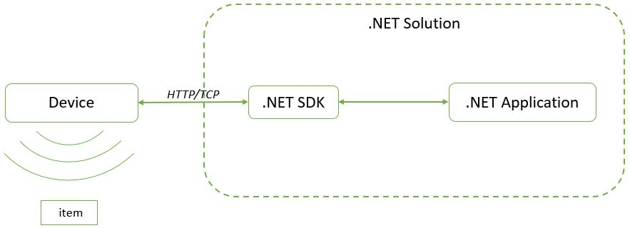

# Intellifi .NET SDK Hello World

This repository contains a very minimalistic [Visual Studio](https://visualstudio.microsoft.com/) project for the [Intellifi](https://intellifi.nl) .NET SDK.

The .NET SDK allows [Intellifi](https://intellifi.nl) [Smartspots](https://intellifi.nl/smartspot) to be used as a stand-alone system
without the need for an active internet connection.

The image below gives an overview of a .NET Ssolution using the *Intellifi .NET SDK*.

## Getting started

1. Install Visual Studio if not already done so.
    - In the *visual studio installer* select the '.NET desktop development' from the available *workloads*.
2. Download the *Intellifi .NET SDK* and extract it.
    - Todo: **insert download instructions**
3. Double click the `net-sdk-hello-world.sln` to op Visual Studio
4. Add the required references to the project.
    - Right click 'References' under 'project' and select 'Add Reference...'
    - Click 'Browse...'
    - Locate the Downloaded *Intellifi .NET SDK* and select the `Newtonsoft.Json.dll` and the `SpotLib.dll` files
    - click 'Add' and click 'OK'.
5. Compile and execute the *.NET SDK Hello World* application by clicking the 'Start' button on the top bar.

## Usage

Make sure that the Smartspot is connected to the Same network and powered on.

Start the application and follow the instructions on the terminal. The application will then show the Presences of the Smartspot in the terminal.

## Further reading

To learn more about the Smartspot and it's capability's, go to [intellifi.zendesk.com](https://intellifi.zendesk.com).

To read about the *Intellifi .NET SDK* api reference, go to [intellifi-nl.github.io/net-sdk-api-reference](https://intellifi-nl.github.io/net-sdk-api-reference)
